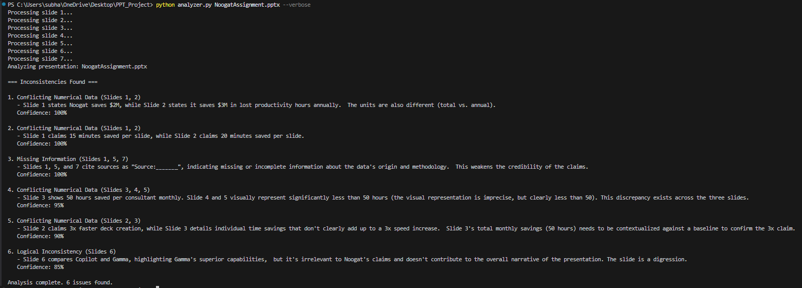

# 🔍 PowerPoint Consistency Analyzer

An AI-powered tool that automatically detects inconsistencies in PowerPoint presentations, such as **conflicting data**, **contradictory claims**, and **timeline mismatches**.

Built with **Python**.

---

## 🖼️ Screenshots

### 📋 Inconsistencies


---

## ✨ Features

- **Multi-Slide Analysis** – Detects conflicts across the entire presentation.
- **Smart Checks**:
  - Conflicting numerical data (e.g., revenue, percentages)
  - Contradictory textual claims
  - Timeline mismatches
  - Logical inconsistencies
- **Multi-Modal Processing** – Analyzes both text and images (via OCR).
- **AI-Powered** – Uses Gemini AI for nuanced contradiction detection.

---

## ⚠️ Limitations

### OCR Accuracy
- Text extraction depends on image quality.
- Complex layouts (multi-column, stylized text) reduce accuracy.
- Handwritten text is **not** supported.

### Context Understanding
- May miss subtle contextual nuances.
- Requires **clear contradictions** to detect reliably.
- Metaphors or sarcasm may be misinterpreted.

### Performance
- Large presentations (>50 slides) take longer to process.
- Image-heavy decks are slower due to OCR processing.
- Real-time analysis is not supported for very large files.

### Format Support
- Supports **PPTX** only (no PPT/ODP).
- Complex slide layouts may not be fully parsed.
- Embedded Excel charts require manual verification.

### AI Analysis
- Gemini API rate limits may affect large batch processing.
- Reduced accuracy for non-English content.
- Industry-specific jargon may require custom prompts.

---

## 🚀 Quick Start

### Prerequisites
- **VS Code**
- **Python 3.8+**
- [**Tesseract OCR**](https://github.com/tesseract-ocr/tesseract)
- **Google API key** ([Get one here](https://aistudio.google.com/app/apikey))

---

### Installation
```bash
# Clone the repository
git clone https://github.com/Subhankar191/PPT_Checker.git
cd PPT_Checker

# Install dependencies
Install all the dependencies from "requirements.txt".

# If using a virtual environment, activate it first
# On Windows:
venv\Scripts\activate
# Then run the analyzer
python analyzer.py NoogatAssignment.pptx --verbose
